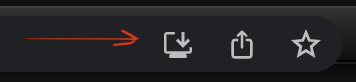

# parliament-pwa

### Get started:

#### Starting on the localhost
1. Clone repo on your PC
2. Install dependencies `yarn`
3. Run `yarn build`
4. Start server `serve -s build`
5. Open browser on [localhost:5000](http://localhost:5000), find loading icon and install app

6. Then app will able in the [apps](chrome://apps/) tab.
7. After the installation, the Internet can be disconnected

#### Starting on the server
1. Clone repo on your PC
2. Install dependencies `yarn`
3. Run `yarn build`
4. Load the `build` folder contents on your server in the root directory
5. Open your site, find loading icon and install the app

6. Then the app will able in the [apps](chrome://apps/) tab.
7. After the installation, the Internet can be disconnected

Enjoy :)

Smoking is bad for your health